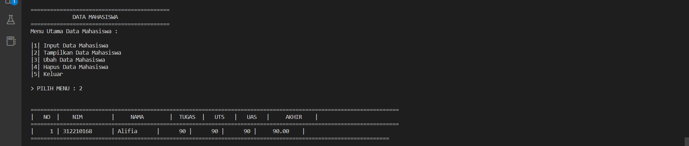
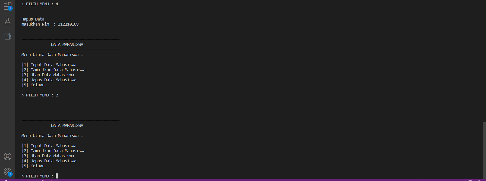
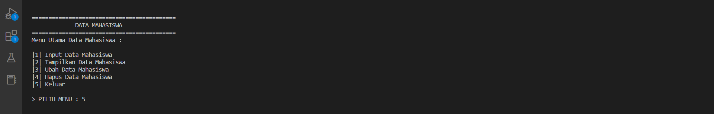

## Praktik8

Nama: Alifia Ananda Putri

Nim: 312210168

Kelas; TI.22.A2

Mapel: B.Pemrograman

## FLOWCHART

## MEMBUAT PROGRAM SEDERHANA DENGAN MENGAPLIKASIKAN PENGGUNAAN CLASS PENJELASAN

1. Membuat delarasi inti atau induk data dengan data = {} class Data(): def __init__(self,nim,nama,tugas,uts,uas,akhir):

2. Deklarasi dictionari dengan datamahasiswa untuk menampung semua data/element.

3. gunakan fungsi def tambah() lalu isis dengan input Nama,NIM,Tugas,UTS,UAS dan perhitungan nilai akhir yang akan dimasukan ke dictonary data mahasiswa.

4. gunakan fungsi def tampilkan() untuk mencetak isi data dari dictonary.

5. gunakan fungsi def hapus(NIM) di isi dengan synyax delet nama pada dictonory data mahasiswa.

6. gunakan funs def ubah(NIM) otomatis inputan anakn menyuruh untuk menuliskan NIM dn semua ellemen akan bisa diubah.

7. gunakan while True untuk menlooping atau mengulang statmet.

8. gunakan statment if,elif,else di dalam while True dan memengil masing-masing fungsi.

## CODE SOURCE

data = {}
class Data():
     def __init__(self,nim,nama,tugas,uts,uas,akhir):
        while True:

            print("\n")
            print('='*43)
            print('             DATA MAHASISWA              ')
            print('='*43)
            print('Menu Utama Data Mahasiswa : \n')
            print('|1| Input Data Mahasiswa        ')
            print('|2| Tampilkan Data Mahasiswa    ')
            print('|3| Ubah Data Mahasiswa         ')
            print('|4| Hapus Data Mahasiswa        ')
            print('|5| Keluar                      \n')

            x = input("> PILIH MENU : ")

            print("\n")

            if x == '1':
                self.TAMBAH()
            elif x == '2':
                self.TAMPILKAN()
            elif x == '3':
                self.UBAH()
            elif x == '4':
                self.HAPUS()
            elif x == '5':
                self.KELUAR()
            
            else:
                exit()

     def TAMBAH(self):
        print("Tambah Data")
        self.nim    = input('Nim Mahasiswa\t    : ')
        self.nama   = input('Nama Mahasiswa\t    : ')
        self.tugas  = int(input('Masukkan Nilai Tugas\t   : '))
        self.uts    = int(input('Masukkan Nilai UTS\t   : '))
        self.uas    = int(input('Masukkan Nilai UAS\t   : '))
        self.akhir = (self.tugas * 30/100) + (self.uts * 35/100) + (self.uas * 35/100)
        data[self.nim] = self.nama, self.tugas, self.uts, self.uas, self.akhir

class mahasiswa(Data):

    def TAMPILKAN(self):
        if data.items():
            print('==================================================================================================================')
            print('|   NO  |    NIM         |     NAMA        |  TUGAS  |   UTS   |   UAS   |     AKHIR    |')
            print('==================================================================================================================')
            i = 0
            for a in data.items():
                i += 1
                print("|    {no:2d} | {0:14s} | {1:11s} | {2:7d} | {3:7d} | {4:7d} |    {5:6.2f}    |".format (a[0][: 14],a[1][0],a[1][1],a[1][2],a[1][3],a[1][4], no = i))
                print('===============================================================================================================')
    
    def UBAH(self):
        print("Ubah Data")
        self.nim = input("Masukkan Nim              : ")
        if self.nim in data.keys():
            self.nama = input("Masukkan Nama\t        : ")
            self.tugas = int(input("Nilai tugas\t   : "))
            self.uts = int(input("Nilai UTS\t       : "))
            self.uas = int(input("Nilai UAS\t       : "))
            self.akhir = (self.tugas * 30/100) + (self.uts * 35/100) + (self.uas * 35/100)
            data[self.nim] = self.nama, self.tugas, self.uts, self.uas, self.akhir
        else:
            print("MAAF, DATA TIDAK DITEMUKAN")

    def HAPUS(self):
        print("Hapus Data")
        self.nim = input("masukkan Nim  : ")

        if self.nim in data.keys():
            del data[self.nim]
        else:
            print("MAAF, DATA TIDAK DITEMUKAN")

    def KELUAR(self):
        print()
        print("---------------------------------------------------------------------------------")
        print("                           PROGRAM TELAH SELESAI                    ")
        print("---------------------------------------------------------------------------------")
        print(35*'=')
        print("NAMA\t: ALIFIA ANANDA PUTRI\nKELAS\t: TI.22.A.2\nNIM\t: 312210168")
        print(35*'=')

datamhs = mahasiswa("nama", "nim", "uts", "uas", "tugas", "akhir")

## HASIL RUNNING

TERIMAKASIH:)

